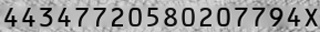
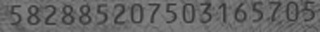
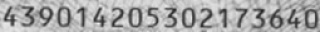
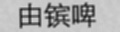
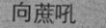

# TextRenderer

This project is an extention of [text_renderer](https://github.com/Sanster/text_renderer). Comparing with [text_renderer](https://github.com/Sanster/text_renderer), TextRenderer supports multiple text generation for training deep learning OCR model (e.g. [caffe_ocr](https://github.com/senlinuc/caffe_ocr)):

- Suport color image generation

- Sohu news corpus generation

- ID Card number generation
 
- ID Card name generation
 
- Label file (`labels.txt`) generation for [caffe_ocr](https://github.com/senlinuc/caffe_ocr)

## Setup
Install dependencies:
```
pip install -r requirements.txt
```

## Demo
### 1. For general OCR
By default, simply run `sh generate_default.py` and generate 20 text images
and a `labels.txt` file in `output/default/`.


### 2. For ID card number OCR
For ID card number OCR, simply run `sh generate_cardid.sh` and generate 20 text images
and a `labels.txt` file in `output/cardid/`.







### 3. For ID card name OCR
For ID card name OCR, simply run `sh generate_name.sh` and generate 20 text images
and a `labels.txt` file in `output/name/`.





### 3. For Sohu news corpus OCR
For Sohu news corpus, simply run `sh generate_sohu.sh` and generate 20 text images
and a `labels.txt` file in `output/sohu/`.


## Config
1. Please run `python main.py --help` to see all optional arguments and their meanings.
And put your own data in corresponding folder.

2. Config text effects and fraction in `configs/default.yaml`, `configs/cardid.yaml`, `configs/name.yaml` file (or create a new config file and use it by `--config_file` option):

|Effect name|Image|
|------------|----|
|Origin(Font size 25)||
|Perspective Transform||
|Light border||
|Dark border||
|Random char space big||
|Random char space small||
|Reverse color||
|Blur||
|Font size(15)||
|Font size(40)||
|Middle line||
|Table line||
|Under line||

## Generate image using GPU
If you want to use GPU to make generate image faster, first compile opencv with CUDA.
[Compiling OpenCV with CUDA support](https://www.pyimagesearch.com/2016/07/11/compiling-opencv-with-cuda-support/)

Then build Cython part, and add `--gpu` option when run `main.py`
```
cd libs/gpu
python setup.py build_ext --inplace
```

## Concat

Please contact <arlencai@tencent.com>
